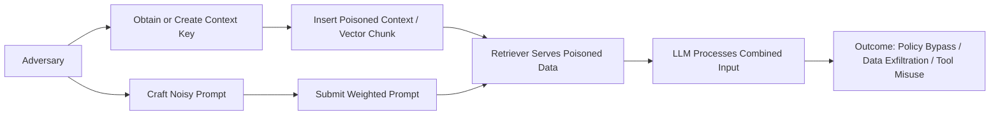
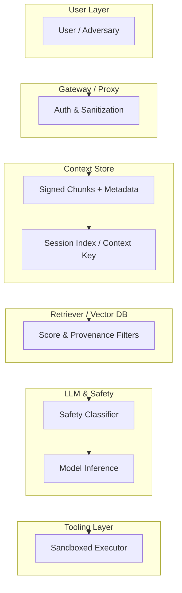

# Adversarial LLM Threats 

**Author:** pablo-chacon
**Date:** October 2025
**License:** MIT

---

## Abstract

Large Language Models (LLMs) have emerged as essential components in modern software systems. While alignment and safety mechanisms have matured rapidly, adversarial strategies that exploit model context, prompt weighting, and retrieval pipelines remain underexplored. This paper presents an original synthesis of three interconnected attack vectors, **noisy prompts**, **weighted prompt manipulation**, and **context-key poisoning**, which together form a potent multi-vector threat model. We analyze their operational dynamics, map them to the STRIDE security framework, and propose pragmatic defensive architectures supported by cryptographic and procedural safeguards. The work is intended to aid developers, researchers, and system architects in designing resilient, auditable, and ethically sound LLM integrations.

---

## 1. Introduction

As generative AI systems integrate into critical infrastructure, adversarial prompt design and context manipulation have emerged as realistic attack surfaces. Security models for LLM-based systems lag behind traditional software paradigms due to their probabilistic and interpretive behavior. Current defenses rely heavily on *alignment training* and *content moderation filters*, which can be circumvented through carefully structured input manipulation.

This paper formalizes a conceptual framework that unifies three observed or theoretically viable vectors: (1) **noisy prompts** that obfuscate intent, (2) **weighted prompts** that bias system-level behavior, and (3) **context-key poisoning** that manipulates persistent or retrievable data to influence subsequent model responses. Together, these constitute a compound adversarial pattern that can erode LLM safeguards even without direct model access.

---

## 2. Related Work

Recent research and industry advisories acknowledge the rise of *prompt injection* and *retrieval poisoning*. Notably, studies by Greshake et al. (2024) and Hubinger (2023) have examined indirect prompt injection in retrieval-augmented generation (RAG) systems. The OpenAI Red Teaming Network (2024) and Anthropic’s Constitutional AI work (2023) identify classifier evasion through linguistic obfuscation as a major challenge. However, the synthesis of adversarial noise, prompt weighting, and context persistence has not been formally articulated in literature to date.

A particularly relevant and recent contribution is ReverseC Labs’ investigation **“Evaluating LLM Input Comprehension and Guardrail Robustness Through Noise-Based Attacks”** (2025). Their analysis demonstrates how controlled input noise can degrade comprehension accuracy and bypass moderation filters directly supporting the threat dimensions discussed in this paper.

This paper contributes by contextualizing these elements within the STRIDE threat framework and offering implementable mitigation patterns.

---

## 3. The Three-Part Adversarial Model

### 3.1 Overview

Adversarial exploitation of LLMs often relies on small perturbations of input or metadata that cascade through retrieval and reasoning pipelines. The following triad represents the most structurally impactful combination:

1. **Noisy prompts**: linguistically convoluted or semantically redundant inputs designed to degrade the precision of safety classifiers while preserving exploitable semantics.
2. **Weighted prompts**: system or developer-level instructions that manipulate internal weighting mechanisms (e.g., message roles, token priority, or metadata fields) to reorient the model’s objective function.
3. **Context-key poisoning**: insertion of malicious data into persistent session or retrieval indices associated with a unique context identifier (`context_key`). Compromise of this key allows adversaries to inject high-trust instructions into future interactions.

### 3.2 Attack Flow Diagram



---

## 4. STRIDE Threat Mapping

The triad maps naturally onto the STRIDE framework (Microsoft, 2005), offering a structured approach for system designers to evaluate risks.

| Category                   | Example                                                        | Likely Impact                    | Mitigation Strategies                                              |
| -------------------------- | -------------------------------------------------------------- | -------------------------------- | ------------------------------------------------------------------ |
| **Spoofing**               | Forged or reused `context_key` for unauthorized session writes | Context impersonation, injection | HMAC signing, short-lived session tokens, identity binding         |
| **Tampering**              | Editing stored chunks or poisoning retrievers                  | Context corruption, data bias    | Signed payloads, immutable logs, RBAC controls                     |
| **Repudiation**            | Lack of auditable provenance                                   | Accountability gaps              | Cryptographic logging, hash chaining                               |
| **Information Disclosure** | Leakage through poisoned retrieval or indirect injection       | PII or secret exposure           | Data classification, output scanning, post-filter classifiers      |
| **Denial of Service**      | Overloaded context or token budget abuse                       | Service degradation              | Rate limiting, token quotas, pre-filter heuristics                 |
| **Elevation of Privilege** | Inducing tool execution or privileged actions                  | System compromise                | Schema-based tool validation, sandboxing, human-in-the-loop review |

A corresponding architecture diagram is provided below.



---

## 5. Defensive Architecture

### 5.1 Principles

* **Trust minimization:** all user-supplied or retrieved content is treated as untrusted.
* **Cryptographic provenance:** all stored context must carry verifiable signatures.
* **Role isolation:** only server-side processes may create or modify system-level or weighted instructions.
* **Schema enforcement:** tool calls and structured outputs must conform to explicit JSON schemas.
* **Continuous verification:** signatures, scores, and classifier decisions are logged and auditable.

### 5.2 Recommended Components

1. **API Gateway:** Authentication, rate limiting, and textual sanitization.
2. **Context Store:** HMAC-signed payloads, append-only, per-user namespaces.
3. **Retriever:** Provenance filters and minimum similarity thresholds.
4. **Safety Classifier:** Pre- and post-model filters using lightweight NLP classifiers.
5. **Executor Sandbox:** Restricted environment for model-invoked tools.
6. **Monitoring:** Real-time anomaly detection and immutable audit logs.

### 5.3 Example Implementation: HMAC Verification

```python
import hmac, hashlib, json, os
SECRET = os.environ.get("CONTEXT_HMAC_SECRET", "replace_in_prod")

def sign_payload(payload: dict) -> str:
    body = json.dumps(payload, sort_keys=True, separators=(',',':')).encode()
    return hmac.new(SECRET.encode(), body, hashlib.sha256).hexdigest()

def verify_payload(payload: dict, signature: str) -> bool:
    return hmac.compare_digest(sign_payload(payload), signature)
```

---

## 6. Detection and Response

### Indicators of Compromise

* Repeated context access from unrecognized origins.
* Failed signature validations in context logs.
* Outlier token consumption patterns.
* Model outputs containing secret-like strings or commands.

### Incident Response Workflow

1. Quarantine affected context keys.
2. Preserve forensic evidence (signed snapshots).
3. Rotate credentials and tokens.
4. Patch retriever filters and classifier thresholds.
5. Conduct post-incident adversarial replay to confirm remediation.

---

## 7. Industry Maturity and Outlook

Most LLM providers including OpenAI, Anthropic, Google DeepMind, and Mistral deploy layered defenses involving alignment training, prompt classifiers, and privilege separation. Nonetheless, public red-team reports and internal studies confirm that sophisticated prompt and retrieval manipulations can still bypass these systems. The field is thus in a *rapid patch-and-adapt* phase analogous to early web security.

Emerging mitigations include:

* Context integrity verification using content hashes and signatures.
* Structured prompting and API-enforced schemas.
* Output watermarking and provenance tagging.
* Formal threat modeling frameworks (NIST AI RMF, EU AI Act annexes).

Continued interdisciplinary collaboration between ML researchers and cybersecurity professionals is essential to achieve mature, predictable security guarantees.

---

## 8. Ethical Considerations

The information in this document is intended solely for defensive, educational, and research applications. Demonstrations or experimental reproductions of these techniques should occur only within controlled environments and with appropriate authorization. The author disclaims all liability for misuse of the material herein.

---

## 9. Conclusion

The triad of **noisy prompts**, **weighted prompts**, and **context-key poisoning** represents a convergent threat pattern that challenges existing LLM defense assumptions. By applying rigorous provenance controls, schema enforcement, and layered monitoring, developers can mitigate these risks without sacrificing system autonomy. As LLMs become critical infrastructure, adopting cryptographic and procedural discipline will be essential to prevent adversarial misuse.

---

## References

* Greshake, K. et al. (2024). *Prompt Injection Attacks Against Retrieval-Augmented Generation.* arXiv preprint.
* Hubinger, E. (2023). *Challenges in Robust LLM Alignment.* Anthropic Research Blog.
* Microsoft Security (2005). *STRIDE Threat Model Overview.*
* OpenAI Red Teaming Network (2024). *Adversarial Prompting Report.*
* ReverseC Labs (2025). *Evaluating LLM Input Comprehension and Guardrail Robustness Through Noise-Based Attacks.* [https://labs.reversec.com/posts/2025/10/evaluating-llm-input-comprehension-and-guardrail-robustness-through-noise-based-attacks](https://labs.reversec.com/posts/2025/10/evaluating-llm-input-comprehension-and-guardrail-robustness-through-noise-based-attacks)
* NIST (2024). *AI Risk Management Framework.*
* EU AI Act (2025). *Regulation (EU) on Artificial Intelligence.*

---
